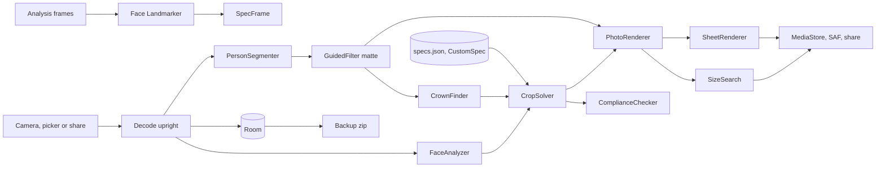

# Cropmark: passport photos that measure themselves, offline

A passport photo is a strict document: head height in millimetres, eyes in a band, plain background, and for online forms exact pixels under a size cap. Free apps crop, then charge weekly for the background. Cropmark draws the rule on the live camera, replaces the background with clean hair edges on the phone, checks the photo, and writes a form-ready JPEG or a print sheet. One price, no ads, camera the only permission.

## 1. Overview

- **Elevator pitch:** an offline passport, visa and ID photo maker with a measuring camera frame, background replacement included, a pass-or-fix check, exact pixel and KB form presets, and 4x6, 5x7, A4 and Letter sheets, sold once.
- **Play category:** Photography.
- **Tagline:** Passport photos that measure themselves, offline.
- **Play positioning line:** The passport photo app that does the whole job, background included, for one price and never sees the internet, built for people burned by a weekly subscription.
- **Names:** display name Cropmark, after the printer's crop marks the spec frame draws. Booth collides with photo-booth apps and pixiv's BOOTH; the refuter's Likeness collides with two face apps already on Play, "Likeness: Imagine with AI" (https://play.google.com/store/apps/details?id=com.okilabs.likeness) and Google's "Likeness (beta)" (https://play.google.com/store/apps/details?id=com.google.android.apps.vr.doppel). Slug `cropmark` and package `com.mohdshayan.cropmark` match the display name (no Cropmark app on Play US or India, checked 2026-09-13). Play title `Passport Photo Maker Offline`.
- **Price:** USD 3.99, INR 149.

## 2. Problem and why now

The buyer needs a compliant photo this week for a passport, DS-160, OCI card or PAN. Demand is proven. Andronepal's Passport Photo Maker VISA/ID has 10M+ installs, 4.5 on 141K ratings, last updated Apr 7, 2025 (https://play.google.com/store/apps/details?id=np.com.njs.autophotos). Passport Photo Online has 10M+ and sells cloud processing (https://play.google.com/store/apps/details?id=online.passportphoto.visa.id.app). zmobileapps has 5M+ at 4.8, and its top review reads "$3.18 EVERY WEEK" (https://play.google.com/store/apps/details?id=com.zmobileapps.passportphoto). India searches for "passport size photo" and "visa photo 35x45" each return 20+ credible apps, mostly free (https://play.google.com/store/search?q=passport%20size%20photo&c=apps&gl=IN).

The refutation holds. TapUniverse lists at USD 4.99 but sold at USD 0.25 on 2026-09-13 (https://play.google.com/store/apps/details?id=com.tapuniverse.passportphoto); Nuts Mobile's USD 5.99 Pro is the twin of a 1M+ free app (https://play.google.com/store/apps/details?id=idphoto.passport.portrait.pro). Standalone paid apps sell little: Documentus Pro USD 2.49 at 10K+ and 3.5 (https://play.google.com/store/apps/details?id=id.photo.maker.passport.photo.visa.print). IDFrame (free, watermark, one-time unlock, 1K+) already claims on-device processing (https://play.google.com/store/apps/details?id=com.idframe.android), so privacy alone does not pull installs. Paid filter: https://play.google.com/store/search?q=passport%20photo&c=apps&price=2.

**Why a buyer pays upfront anyway:**

1. **The whole job is in the price.** The free leaders crop and tile for nothing but charge for background removal or the export, and edge artifacts are the top one-star complaint. Cropmark's background, hair edges and export are included; USD 3.99 is less than a week and a half of zmobileapps' USD 3.18 weekly charge.
2. **India and form presets done exactly.** TapUniverse, the best-rated paid app, has no India 35x45 preset. Cropmark ships the India passport upload for applications abroad, PAN, OCI and e-Visa beside DS-160 and China, and searches JPEG quality until the file lands inside the form's limits (DS-160 600x600 px under 240 KB and no more than 20:1 compression; PAN 20 KB at 200 dpi).
3. **The camera measures before the shutter,** and a check catches a rejection at home.
4. **Counter operators shoot for every walk-in.** Volume and Bluetooth remote shutter, counter mode and history mean one price covers every customer, where a weekly subscription never stops.
5. **The screenshots are the demo.** The batch bans IDFrame's watermark-then-unlock model, so shots one to four are real pipeline output, the listing names what is not included, and Play's refund window covers a buyer whose first photo disappoints.
6. **Checkable privacy:** camera is the only permission; a tiebreaker, not the headline.

The refuter forecasts tens to a few hundred sales a year; the build is sized at 5 weeks.

## 3. Target audience and personas

- **Suresh Yadav, 38, CSC counter, Gorakhpur.** Makes PAN and passport photos for walk-ins. Types **"passport size photo"**. Pays INR 149 at the screenshot of a remote shutter and eight 35x45 photos on one 4x6: one price for every walk-in.
- **Dana Kowalczyk, 41, school administrator, Columbus, Ohio.** Renewing four passports; cancelled a weekly subscription last year. Types **"passport photo maker"**. Pays at the 2x2 and 4x6 screenshots beside "One-time purchase", then prints at a kiosk.
- **Fatima Siddiqui, 23, MS applicant, Hyderabad.** Her DS-160 photo failed on size and a shadowed wall. Types **"visa photo 2x2"**. Pays when screenshot four shows a DS-160 file at "600 x 600 px, 212 KB" and screenshot three lists an uneven-lighting check.

## 4. Core concept deep-dive

**The spec drives everything.** The user picks a document first. Its spec (size, head height chin to crown, eye band, backgrounds, KB limits, notes) feeds frame, crop, checks, exporter and sheets, so switching documents re-solves the photo without a retake.

**Pipeline.** The image is decoded upright and scaled to a 2048 px working copy. MediaPipe Face Landmarker gives chin, eye centres, midline, roll, yaw, pitch and eye openness. MediaPipe Selfie Segmenter gives a 256x256 person mask; a Kotlin guided filter upsamples it against image luminance to recover hair strands, and decontamination strips the old background tint from edges. The crown is the top matte row above the forehead, so hair counts where the rules count it; for IRCC, whose crown is the top of the skull, the solver never places the crown above the forehead-proportion estimate. The solver scales head height to mid-range, puts the eyes mid-band and centres the midline.

**The one memorable thing: the spec frame.** On the live viewfinder, magenta brackets mark where crown and chin must fall, a magenta band marks the eye line, and a millimetre ruler on the right edge shows the head range. When the face fits, the brackets fill and the shutter label changes from "Move closer" to "Take photo". The frame stays on the editor, so the rule is always where the photo is.

**What it refuses to do.** No upload or submission; no "official" or "guaranteed acceptance"; no flags or seals. No glasses detection (unreliable; a reminder instead). No beauty filters. No Aadhaar presets: that photo is taken at enrolment. No Multiclass model, per the refuter's cut.

## 5. Complete feature set

**v1.0:**

1. **Spec picker:** 8 documents (section 9, cut from 15 after the 2026-09-14 source check), locale-ordered, searchable, each with source and "Rules last checked" date.
2. **Measuring capture:** live frame, both lenses, 3 or 10 second timer, hints ("Tilt your head level").
3. **Remote shutter:** volume keys and Bluetooth selfie remotes (key events, no permission).
4. **Input from anywhere:** system photo picker and an image share target.
5. **Background replacement:** white, light blue, light grey, custom, or keep; guided-filter hair edges and a five-step feather. Only where the issuer allows edits: a spec with `editsAllowed: false` (US passport, DS-160, India passport abroad, OCI, Canada visa) keeps the background and exposure as shot and offers crop only. A spec whose colour list is the issuer's whole rule (`backgroundsExhaustive`, China visa) offers only those colours, ignores a global starting colour it does not allow, and fails the background check on any other.
6. **Auto crop plus fine tune:** drag and pinch nudges clamped to the spec, one exposure slider. No warmth editor (cut).
7. **Compliance check:** one face, head height, eye line, centring, roll under 5 degrees, yaw and pitch under 8, eyes open, mouth closed (advisory), exposure, lighting balance, background evenness and colour (a colour outside a closed list fails; on a spec with `whiteBackgroundRejected` a kept wall that measures near white and near neutral is an advisory, since only luma and saturation are measured), pixels for 300 dpi.
8. **Form files:** exact pixels, 300 dpi header, JPEG size search within KB limits, no EXIF; saved to Pictures/Cropmark or shared.
9. **Print sheets:** 4x6 and 5x7 JPEG, A4 and Letter PDF, cut lines, 2 mm gaps and 3 mm margins (under 4 copies, an edge-to-edge layout with a "Print with no borders" hint), a 50 mm check ruler on A4 and Letter; the PDF goes to any print app through Save or Share.
10. **Custom size** in mm or px with head range, eye band and KB limits.
11. **History:** captures autosaved with their edits; re-export in another size without retaking; delete one or all.
12. **Counter mode:** after export, back to the camera with the same spec.
13. **Backup and restore** as one zip.
14. **Two-pane layout** at 600dp and wider.

**v1.x:** Hindi strings; more verified specs; infant mode; signature crop; torch; system print dialog; customer labels in counter mode (moved out of 1.0 to hold the 5-week budget). **v2:** two people per sheet. **Cut:** 60+ countries, Multiclass model, warmth editing, print ordering, any upload.

## 6. Screen-by-screen UX

**Navigation:** one stack from Home; History and Settings icons in Home's top bar.

- **Home:** "What is the photo for?", search, locale suggestions, list by country, recent photos.
- **Spec sheet:** to-scale diagram, ranges, source and date; "Take photo", "Choose from gallery".
- **Capture:** preview, spec frame, hint, shutter, lens, timer; one-line rationale before the camera dialog.
- **Editor:** photo and frame; Background, Feather, Exposure, Adjust crop; checks row ("11 of 12 passed").
- **Checks:** each rule with pass or fix; tapping a fix highlights its guide.
- **Export:** "Form file" (size, KB, "Save photo", "Share") and "Print sheet" (paper, copies, cut lines, "Save sheet", "Share").
- **History:** grid by date; detail shows past exports and "Export another size".
- **Custom size**; **Settings** (shutter, timer, counter mode, theme, counts, "Back up photos", "Restore backup", "Delete all photos", privacy, licences).

**Flow, first minute (Dana):** suggested "US passport", "Choose from gallery", skeleton, Editor cropped on white, "12 of 12 passed", 4x6 sheet, "Save sheet", toast "Sheet saved".

**Flow, the counter (Suresh):** counter mode on; "PAN card", "Take photo", brackets fill, remote click, "Save photo", toast "Photo saved", camera reopens on PAN.

**Flow, re-export (Fatima):** History, DS-160 photo, "Export another size", "India e-Visa", crop re-solved from the stored matte, "Share".

## 7. Design system

**Reading this as:** a precise document tool for anxious applicants and counter operators, with a photo-booth measuring language, leaning toward Sofia Sans Condensed plus Public Sans on a **booth grey and registration magenta** palette.

Photos are judged on neutral booth-wall grey. Magenta is the printer's crop-mark colour and never occurs in skin, hair or photo backgrounds, so guides never blend into the photo.

**Dials.** Variance 3: nervous users need predictable, centred layouts. Motion 2: only the frame moves, answering the face. Density 4: controls beside the photo, not over it.

**Colour tokens:**

| Token | Light | Dark | Role |
|---|---|---|---|
| Backdrop | #EEF0F3 | #15181D | background, surface, window |
| Panel | #DFE3E9 | #20252C | sheets, fields, control strip |
| Ink | #1A1F27 | #E6E9EE | text, primary button fill |
| Slate | #525C69 | #9BA5B2 | secondary text, ruler numerals |
| Rule | #B7BFCA | #3A424D | dividers, outlines, skeletons |
| Magenta | #B0276A | #E5639F | the one accent: spec frame, ruler range, selected ring, fix rows, focus |

Magenta saturation 64 percent light, 71 dark. Measured: Ink on Backdrop 14.5:1; Slate 6.0:1 light, 7.1:1 dark; Magenta 5.5:1 on Backdrop and 4.9:1 on Panel, so fix-row text may be Magenta. Buttons are Ink with Backdrop labels; Rule is never text and only decorates, so field and chip outlines use Slate (5.3:1 on Panel). Over photos, guides get a 1.5dp Backdrop halo, since Magenta on mid skin tones is near 1:1. Fix rows pair Magenta with a cross icon, pass rows Slate with a check. Output backgrounds are spec pixel values, not tokens. Dynamic colour off.

**Type.** Sofia Sans Condensed (Google Fonts, SIL OFL 1.1) SemiBold 600 for measurements and titles: "35 x 45 mm" at 28sp, ruler numerals 12sp, titles 22sp, `tnum` on. Public Sans (Google Fonts, SIL OFL 1.1), a neutral form-reading sans: body 16sp 400, labels 14sp 500, buttons 15sp 600. Licences in `docs/OFL-SofiaSansCondensed.txt` and `docs/OFL-PublicSans.txt`.

**Radius scale.** 0 for anything standing for paper (photo, sheet, size diagram); RadiusSm 6dp chips and swatches; RadiusMd 12dp buttons; RadiusLg 20dp sheet tops. Lists unboxed.

**Icons.** Material Icons Outlined 24dp in Slate, plus crown-bracket and cut-mark vectors; every icon-only button has a `contentDescription`.

**Launcher icon** (ICON.md): **magenta** ground #D6337F to #B01E6A (saturation 67 and 71 percent, lightness 52 and 40) under a faint rose highlight; a near-white #FFF4FA ID print in the 35x45 proportion, its head and shoulders knocked out so the magenta ground shows through the subject, and eight printer crop marks standing off the print's four corners the way a trim mark sits outside a plate. Measured on the render: 4.2:1 at the thinnest crop mark where the highlight lifts the ground most, 4.9:1 on the deeper stop and 5.6:1 on the print's own edge, so every part clears 3:1. The same silhouette fills the monochrome layer. No portfolio icon is a light card on a saturated ground, no icon on either contact sheet leads with a bright magenta ground, and the mark is a print rather than a person glyph, so it does not read as a contacts or face-detection icon at launcher size.

**Motion.** One first-run moment: the first tracked face pulls the brackets in from the edges over 350 ms. Brackets follow the face in 120 ms, background swaps cross-fade in 150 ms. Reduced motion snaps everything.

**States:**

| Screen | Empty | Loading | Error | Success |
|---|---|---|---|---|
| Capture | "Find a face in the frame" | preview skeleton | "Cropmark needs the camera to take your photo." + "Choose from gallery"; "Another app is using the camera." + "Try again" | "Photo taken" |
| Editor, Checks | none | photo-shaped skeleton, "Finding face and edges" | "No face found. Use a photo showing head and shoulders."; "Two faces found. Use a photo of one person." | "12 of 12 passed" |
| Export | none | preview skeleton | "This photo will not fit under 240 KB at 600 px. Choose a plain background and save again."; "Could not save. Choose another location." | "Photo saved", "Sheet saved" |
| History | "No photos yet." + "Make a photo" | grid skeleton | "This file is not a Cropmark backup." | "Backup restored" |
| Home | no recents: "Pick a document to start" above the full list | none, specs bundled | search with no match: "No document matches. Make a custom size." + "Custom size" | spec chosen, Spec sheet opens |
| Spec sheet | none, every spec has a diagram | none | "Rules last checked" older than 18 months: "Check the issuer's page before you print." | "Take photo" opens Capture |
| Custom size | "Enter a width and height" | none | inline "Enter a height from 10 to 150 mm" | "Size saved" |
| Settings | none | none | "Could not write the backup. Choose another location." | "Backup saved", "All photos deleted" |

**Access and large screens.** WCAG AA; 48dp targets; TalkBack reads the frame ("Head too small, move closer"); text to 200 percent. At 600dp Editor and Export split into photo and controls; rotation keeps state in the ViewModel.

**Screenshots.** Six 1080x1920 (5 and 6 dark), real pipeline output from a CC0 portrait (licence in `docs/PORTRAIT-LICENCE.md`) through the photo picker: PAN card frame on white; e-Visa on light blue; US passport checks with the background fix; PAN form file under 20 KB; 4x6 sheet of twelve; history with past exports.

## 8. Native architecture

**Generator flags line:**

`new-native-app.sh --name "Cropmark" --pkg com.mohdshayan.cropmark --perms "CAMERA" --room --camerax --orient unspecified --bg "#EEF0F3" --bg-dark "#15181D"`

**Modules.** `:app` only; geometry, matte and JPEG logic in `core/` without Android imports, JVM-tested.

**Package map** (`com.mohdshayan.cropmark`):

- `core/spec` (`SpecCatalog`, `SpecMath`), `core/crop` (`CropSolver`, `CrownFinder`), `core/matte` (`GuidedFilter`, `Decontaminate`), `core/check` (`ComplianceChecker`), `core/sheet` (`SheetLayout`), `core/jpeg` (`SizeSearch`, `JfifDensity`), `core/backup`
- `ml`: `FaceAnalyzer` (IMAGE mode stills, VIDEO mode frames), `PersonSegmenter`; lazy, closed on `onTrimMemory`
- `camera`: `CameraController` (Preview, ImageCapture max quality, ImageAnalysis 640x480 keep-latest), `ShutterKeys` (MainActivity `onKeyDown` for volume, camera and enter while Capture is resumed)
- `render`: `PhotoRenderer`, `SheetRenderer` (JPEG and `PdfDocument`)
- `data/db`, `data/prefs`, `data/repo` (`PhotoRepository` owns `filesDir/captures` and `filesDir/mattes`, plus `ExportRepository`, `BackupRepository`)
- `ui/<screen>` per section 6, `ui/components` (`SpecFrame`, `MmRuler`, `SizeDiagram`), `ui/nav`, `ui/theme`; `review/ReviewPrompter`

**ViewModels:** `AndroidViewModel` with `stateIn(WhileSubscribed(5_000))`; `EditorViewModel` holds bitmap, face and matte and debounces edit saves; heavy work on `Dispatchers.Default`.

**Catalog aliases:** `androidx-core-ktx`, `androidx-core-splashscreen`, `androidx-lifecycle-runtime-ktx`, `androidx-lifecycle-runtime-compose`, `androidx-lifecycle-viewmodel-compose`, `androidx-activity-compose`, `androidx-compose-bom`, `androidx-ui`, `androidx-ui-graphics`, `androidx-ui-tooling`, `androidx-ui-tooling-preview`, `androidx-material3`, `androidx-material-icons-extended`, `androidx-navigation-compose`, `androidx-room-runtime`, `androidx-room-ktx`, `androidx-room-compiler`, `androidx-datastore-preferences`, `androidx-camera-core`, `androidx-camera-camera2`, `androidx-camera-lifecycle`, `androidx-camera-view`, `kotlinx-coroutines-android`, `kotlinx-coroutines-test`, `kotlinx-serialization-json`, `junit`. Uncomment `mediapipe-tasks-vision` (1.0.0) and `androidx-window`. Add `androidx-exifinterface` (`androidx.exifinterface:exifinterface:1.3.7`, orientation on Android 8) and `play-review-ktx` (`com.google.android.play:review-ktx:2.0.2`). Plugins: `android-application`, `kotlin-android`, `kotlin-compose`, `kotlin-serialization`, `ksp`. ML Kit is not used: its transport library merges network permissions.

**Hardware and assets.** Front and back cameras. `assets/models/face_landmarker.task` (about 4 MB) and `selfie_segmenter.tflite` (249,537 bytes), both Apache 2.0 from Google's MediaPipe model pages, licences in `README.md`; `assets/specs/specs.json`. No asset pack. Report measured first-run inference.

**Permissions:**

- `android.permission.CAMERA`: takes the passport photo with the live measuring frame; frames are analysed in memory and only the photo taken is stored, on the device.

Nothing else. The manifest adds `tools:node="remove"` for `INTERNET` and `ACCESS_NETWORK_STATE` in case a dependency merges them. No `READ_MEDIA_IMAGES` (picker), no `WRITE_EXTERNAL_STORAGE` (MediaStore on 10+, document picker on 8 and 9), no Bluetooth permission; a `FileProvider` serves sharing.

**Background work.** None; everything runs in the foreground. No WorkManager, widgets or tiles.

## 9. Data model

**Room** (version 1, `exportSchema = false` until shipped):

- `PhotoCapture`: `id: Long` PK, `createdAt: Long`, `source: String` (camera, gallery, share), `lensFacing: String?`, `originalFile: String`, `originalSha256: String` (indexed), `widthPx: Int`, `heightPx: Int`, `faceJson: String?`, `matteFile: String?`, `updatedAt: Long`.
- `PhotoEdit`: `captureId: Long` PK and FK cascade, `specId: String`, `backgroundMode: String` (keep, white, light_blue, light_grey, custom), `backgroundArgb: Int`, `featherLevel: Int`, `exposureEv: Float`, `nudgeScale: Float`, `nudgeXmm: Float`, `nudgeYmm: Float`.
- `ExportRecord`: `id: Long` PK, `captureId: Long` FK cascade indexed, `specId: String`, `kind: String` (form_file, sheet_jpeg, sheet_pdf), `paper: String?`, `copies: Int?`, `widthPx: Int`, `heightPx: Int`, `bytes: Long`, `fileName: String`, `savedUri: String?`, `checksPassed: Int`, `checksTotal: Int`, `createdAt: Long`.
- `CustomSpec`: `id: Long` PK, `name: String`, `widthMm: Float?`, `heightMm: Float?`, `widthPx: Int?`, `heightPx: Int?`, `dpi: Int`, `headMinPct: Float`, `headMaxPct: Float`, `eyeMinPct: Float?`, `eyeMaxPct: Float?`, `minKb: Int?`, `maxKb: Int?`, `backgroundArgb: Int`, `createdAt: Long`.

**Bundled specs** (`specs.json`, `{format: 1, specs}`; each row has `id`, `name`, `country`, `print?`, `digital?`, `headMm` or `headPct`, `eye?`, `backgrounds`, `backgroundsExhaustive?`, `whiteBackgroundRejected?`, `notes`, `sourceUrl`, `verifiedOn`):

| id | Output | Head, chin to crown | Background | Edits | Official source (checked 2026-09-14) |
|---|---|---|---|---|---|
| us-passport | 2x2 in | 25.4 to 34.9 mm, eyes 28.6 to 34.9 mm up | white | no | https://travel.state.gov/en/passports/apply/help/photos.html (size, head, background, "do not change your photo using software"); eye band from https://travel.state.gov/content/travel/en/us-visas/visa-information-resources/photos/photo-composition-template.html |
| us-ds160 | square 600 to 1200 px, max 240 KB, compression 20:1 or less | 50 to 69 percent, eyes 56 to 69 percent | white | no | https://travel.state.gov/content/travel/en/us-visas/visa-information-resources/photos/digital-image-requirements.html and the composition template above |
| in-passport | 630x810 px, max 250 KB (applications through a mission) | face 80 to 85 percent | white | no | https://www.hciwellington.gov.in/page/changes-in-indian-passport/ and https://cgivancouver.gov.in/public_files/assets/pdf/Guidelines_for_uploading_ICAO_2025.pdf ("unaltered by computer software") |
| in-evisa | square 350 to 1000 px, 10 KB to 1 MB | ICAO default | white | yes | https://indianvisaonline.gov.in/evisa/tvoa.html (KB, square, background); pixels from https://indianvisaonline.gov.in/visa/VSS_IMAGE.pdf |
| in-oci | square 200 to 900 px, max 200 KB | 49 to 69 percent, eyes 56 to 69 percent | light, not white (`whiteBackgroundRejected`) | no | https://ociservices.gov.in/onlineOCI/faq (pixels, KB, background) and https://ociservices.gov.in/Photo-Spec-FINAL.pdf (head, eyes, "do not retouch") |
| in-pan | 25x35 mm; file 197x276 px at 200 dpi, max 20 KB | ICAO default | white (issuer names none) | yes | https://tin.tin.proteantech.in/pan/InstructionDSC.html |
| ca-visa | 35x45 mm | 31 to 36 mm, to the top of the skull where hair hides it (`crownAtSkull`) | white | no | https://www.canada.ca/en/immigration-refugees-citizenship/services/application/application-forms-guides/temporary-resident-visa-application-photograph-specifications.html |
| cn-visa | 33x48 mm | 28 to 33 mm | white only (`backgroundsExhaustive`) | yes | https://www.visaforchina.cn/SYD3_EN/qianzhengyewu/jichuzhishi/changjianwenti/355135188537315328.html (Chinese Visa Application Service Centre, per the MFA Consular Department) |

**Removed on 2026-09-14** (from the app, the listing and the screenshots): `in-photo` (no issuer publishes a generic India passport size); `uk-passport` (gov.uk forbids printed photos cut down from a larger picture and crops digital photos itself); `ca-passport` (IRCC requires a commercial photographer and rejects home prints and any cropping); `schengen`, `sa-visa`, `ae-visa`, `br-visa` (no official page gives the size or head range; 43x55 mm for the UAE is an agents' convention). The China digital file (354x472 to 420x560 px, 40 to 120 KB) was dropped because no official page publishes it. OCI pixels and KB were corrected from 1500 px and 500 KB to 900 px and 200 KB, PAN from 300 dpi and 50 KB to 200 dpi and 20 KB, and DS-160 gained the 20:1 compression rule.

ICAO default is 70 to 80 percent of height, labelled "The issuer gives no head size; using the common ICAO range." **Verification rule:** in week 1 each row is checked against its issuing authority's page, whose URL and date fill `sourceUrl` and `verifiedOn`; wrong values are corrected, unsourceable rows removed from app and listing. `in-passport` follows the Passport Seva ICAO guideline that Indian missions published for September 2025 (630x810 px); no official page gives a millimetre print size, so the row is digital only. Yearly updates.

**DataStore keys:** `camera_rationale_shown`, `first_frame_moment_shown`, `last_spec_id`, `default_background`, `lens_facing`, `volume_shutter`, `timer_seconds`, `counter_mode`, `sheet_paper`, `cut_lines`, `theme`, `successful_exports`, `review_prompted`, `local_counts_enabled`, `count_*`.

**Export and import.** Photos leave as JPEG or PDF. The backup `cropmark-backup-<date>.zip` via `CreateDocument` holds `manifest.json` (`{format: 1, exportedAt, captures[{..., edit, exports}], customSpecs, settings}`) plus `captures/<sha256>.jpg` and `mattes/<sha256>.png`, via `java.util.zip`. `OpenDocument` import rejects files without `format`, remaps ids, skips known `originalSha256`, suffixes clashing custom names " (imported)". Cloud backup excluded in `data_extraction_rules.xml`.

## 10. Pricing and countries

**USD 3.99, INR 149.** Rung: creative or media tool (USD 3.99), the refuter's sharpened price, under TapUniverse's 4.99 and Nuts Mobile's 5.99 list prices. INR 149 rather than the rung's 199, matching the refuter's sharpened price: India is price-sensitive and served by CSC and cyber cafe counters. INR 149 is itself a ladder point (the consumer log and game rungs), so India stays on the ladder; it is set by hand, other countries follow Play's conversion of USD 3.99.

**Launch pricing.** 25 percent off in week two; never USD 0. **Refunds.** Play's 48-hour window is the trial; later email requests are honoured.

**Why this niche pays.** Nobody browses for a passport photo; they search with a deadline, a form open in another tab and a fee already paid. A rejected photo costs a second appointment or a delayed visa slot, and the paid filter lists this job at USD 2.49 to 5.99. USD 3.99 sits under TapUniverse's and Nuts Mobile's list prices and above the USD 2.49 app rated 3.5, so it reads as careful rather than cheap, and it costs less than two weeks of the weekly subscription the buyer already resents.

## 11. Play Store listing

- **Title:** `Passport Photo Maker Offline` (28 characters)
- **Short description:** `Passport, visa and ID photos offline. One-time purchase, no ads, no upload.` (75 characters)
- **Full description:** the current text is in `store/listing.md` (rewritten on 2026-09-14 for 8 documents and the per-issuer edit rule; the one-time purchase paragraph appears once).
- **Keywords:** passport photo maker, passport size photo, visa photo, id photo maker offline, 2x2 photo, 35x45 photo, DS-160 photo, PAN card photo, OCI photo, passport photo 4x6.
- **Captions** (retaken 2026-09-16 from the reviewed build, verified documents only): 1 "Sized to the rule, fully offline" 2 "New background, hair kept" 3 "Catch a rejection at home" 4 "Exact KB for online forms" 5 "Print sheets with cut lines" 6 "Another size, no retake"
- **Feature graphic:** magenta gradient, bust mark, "Cropmark" in Sofia Sans Condensed, "Passport and visa photos, made offline".
- **Category** Photography; **rating** Everyone; **target age** 13 and over.
- **Stated plainly:** paid, no ads, no in-app purchases, works offline.

## 12. Policy and data safety

Manifest: CAMERA only. Data safety: collected none, shared none; no analytics, crash or ads SDK. Privacy policy from `make-privacy-policy.py --app "Cropmark" --org "SocialSure Private Limited" --permissions CAMERA --out docs`, linked in Settings. **Government apps declaration:** not affiliated; the description says so and the app shows each rule's source. No photo permission declaration (picker), no Health, Financial, News or Families forms, no advertising ID. CAMERA needs no declaration form; Capture shows its one-line reason before the system prompt and the gallery path keeps working when it is denied. Face landmarks and mattes are computed and stored on the device only, so the Data safety answer for photos and biometric data is "not collected". Never claim "official", "approved", "accepted by" or agency endorsement; no flags, seals, emblems, passport covers, competitor or retailer names.

## 13. Organic growth

**Search.** Title carries "passport photo maker" and "offline"; short description adds "visa", "ID photos", "one-time purchase". The first lines add "background" and "print sheet", which Play indexes from the full description; DS-160, PAN, OCI, 35x45 and 2x2 catch the long tail.

**Review prompt.** `review-ktx`, once, after the third successful save on separate days; never on first launch.

**Launch.** A 30-second clip of the frame locking and background swapping, for student-visa and CSC communities; week-two sale; an application to Play Pass once the rating holds at 4.5.

**Not done.** No paid acquisition, incentivised reviews, Lite twin or watermark trial.

## 14. KPIs

**Local counts,** opt-in in Settings and off by default: photos taken, form files saved, sheets saved, backups written. They live in DataStore, show on the Settings screen for the user's own curiosity, and are never sent anywhere; the developer reads nothing from the device.

**Three numbers** (Play Console): (1) at least 10 sales a month by month three with search the top source; (2) refunds under 12 percent over 28 days, proving buyers are not exporting and refunding; (3) rating 4.5 or higher with no one-star reviews citing hair edges or wrong sizes. If sales stall below the first number while refunds stay low, the listing is the problem (title, screenshots one to three); if refunds climb, the pipeline is, and hair edges get the next release.

## 15. Risks and mitigations

- **Refund window on a rare task.** A buyer can export and refund. Mitigation: value past first use (history, family, counter mode); accept some loss over a banned watermark.
- **Biggest free incumbents.** Andronepal and zmobileapps crop and tile free. Mitigation: screenshots 2 and 4 show background and KB presets, which they charge for or lack.
- **Hardest subsystem: hair matte and crown.** A 256x256 mask blurs curly hair, and the crown sets head height. Mitigation: guided filter JVM-tested in week 2; feather control; crown falls back to the forehead landmark plus a proportion estimate, flagged "Crown estimated"; real curly-hair review in week 3.
- **Rule drift.** Mitigation: week-1 verification, dated sources, yearly updates, no acceptance promises.
- **Merged network permissions.** Mitigation: MediaPipe, not ML Kit; `tools:node="remove"`; `aapt dump permissions`.
- **Slow devices.** Mitigation: 2048 px working copy, lazy models.

## 16. Competitive landscape

| App | Price | Installs | Rating | Updated | Why Cropmark |
|---|---|---|---|---|---|
| Andronepal VISA/ID | free, ads, IAP | 10M+ | 4.5 (141K) | Apr 7, 2025 | Background included, no ads |
| Passport Photo Online | free, paid cloud | 10M+ | 4.5 (85.9K) | Sep 7, 2026 | Nothing uploaded |
| zmobileapps Editor | free, weekly sub | 5M+ | 4.8 (87.1K) | Mar 19, 2026 | One price, not weekly |
| TapUniverse | USD 4.99 list | 100K+ | 4.9 (6.25K) | Dec 23, 2025 | India presets, KB-exact files |
| Nuts Mobile Pro | USD 5.99 | 100K+ | 4.6 (1.61K) | Aug 20, 2026 | Cheaper, on device |
| Documentus Pro | USD 2.49 | 10K+ | 3.5 (188) | Mar 18, 2026 | Checks and hair matte |
| Global Apps Pro | USD 2.49 | 1K+ | 4.4 | Aug 27, 2025 | Live measuring frame |
| Coocent | USD 24.99 | 1K+ | 4.5 | Aug 20, 2026 | A sixth of the price |
| Fuon Apps | USD 2.99 | 50+ | 4.4 | Aug 28, 2025 | Form presets, sheets |
| IDFrame | free, unlock IAP | 1K+ | 5.0 (13) | Sep 3, 2026 | No watermark step, counter mode |
| netxsoft ID Photo Pro | free, IAP | 1K+ | none | Jul 22, 2026 | Nothing to unlock |

## 17. Development plan

- **Week 1:** generate, `make-key.sh cropmark`; verify the specs (8 kept of 15); `SpecMath`, `CropSolver`, `SheetLayout`, `SizeSearch`, `JfifDensity` with tests; Face Landmarker and picker to a solved crop.
- **Week 2:** segmenter, `GuidedFilter`, `CrownFinder`; Editor with background, feather, exposure and nudges; Room persistence.
- **Week 3:** `ComplianceChecker` and Checks; CameraX, `SpecFrame`, `MmRuler`, shutter keys, timer, denied path.
- **Week 4:** form files, sheets and PDF, Export, History and re-export, counter mode, Custom size, backup and restore, share target.
- **Week 5:** theme, fonts, dark, reduced motion, TalkBack, two-pane, review prompt, icon, policy, listing, screenshots, verify, smoke.

**Total: 5 weeks.** **If behind, cut:** Custom size (and "Add your own size" in the listing); share target; the two-pane split (the single column must still hold at 600dp). Never cut background, frame, checks, KB presets, the four sheet sizes, history, backup or remote shutter.

**JVM tests:** `SpecMath` (35 mm at 300 dpi is 413 px); `CropSolver` (synthetic landmarks hit mid-range within 1 px); `SheetLayout` (35x45 on 4x6 fits 8; 2x2 in on 4x6 fits 2 spaced, tight gives 6; 35x45 on A4 fits 30); `SizeSearch` (DS-160 lands 200 to 240 KB with a stub encoder; China minimum raises size first; impossible cap errors); `JfifDensity` (reads 300 dpi, still decodes); `GuidedFilter` (steeper edge than bilinear); `CrownFinder` fallback; `ComplianceChecker` (roll 7 fails, 3 passes; closed eyes fail); `SpecCatalog` (every row sourced and dated); backup round-trip, missing `format` rejected, duplicates skipped.

**Emulator smoke:** deny camera, gallery works; poster face locks frame; volume key shoots; DS-160 under 240 KB; sheets save; re-export; backup and restore; rotation, dark, animations off, 600dp, airplane mode.

**android-ship preflight:** `build.sh cropmark` shows `CN=SocialSure Private Limited`, tests green; `verify.sh` no FAIL; release APK permissions CAMERA only; release restores a backup (R8 rules for MediaPipe); listing 28, 75 and 1636 characters; six screenshots, icon, feature graphic; privacy policy, OFL files and portrait release in `docs/`; `smoke.sh cropmark com.mohdshayan.cropmark` passed; zero em-dash and en-dash characters.
